<p align="center">
  <a href="https://herdcats.dev">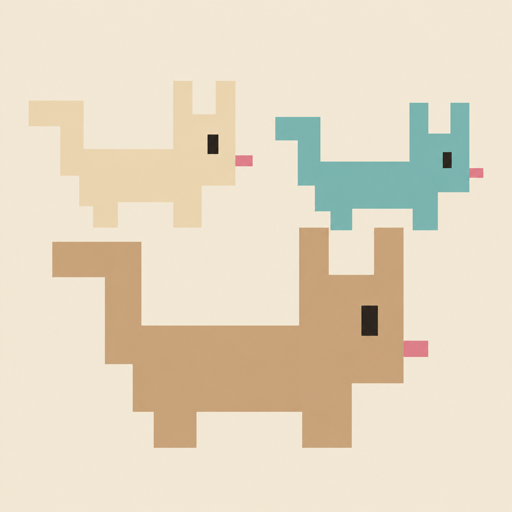</a>
</p>

# Herdcats

[](https://github.com/zhiyao/herdcats/actions/workflows/ci.yml)

[Website](https://herdcats.dev)

A native iPhone client for [Herdr](https://herdr.dev). Connect over SSH to
browse spaces and agents, read pane output, and send terminal input, composed
messages, dictation, and photos from your phone.

Herdcats uses SwiftUI and Observation on iOS 17 or later. It runs the remote
`herdr` CLI over SSH; it needs no companion daemon or custom relay.
[Tailscale](https://tailscale.com) is the recommended way to connect your phone
and Herdr machine. Any network that can reach the SSH server also works.

This is an early release. See the limitations below before using it.

## Screenshots

iPhone screenshots with sample data. Click an image to view it larger.

<p align="center">
  <a href="assets/screenshots/01-spaces.png">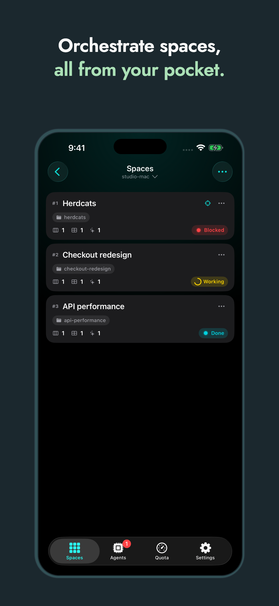</a>
  <a href="assets/screenshots/02-agents.png">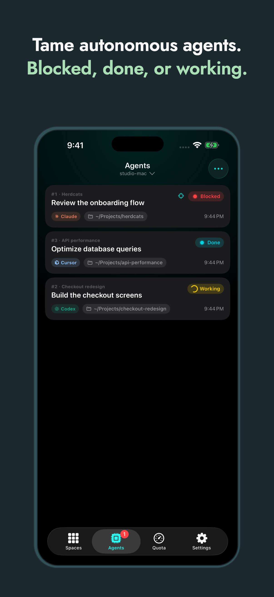</a>
  <a href="assets/screenshots/03-pane.png">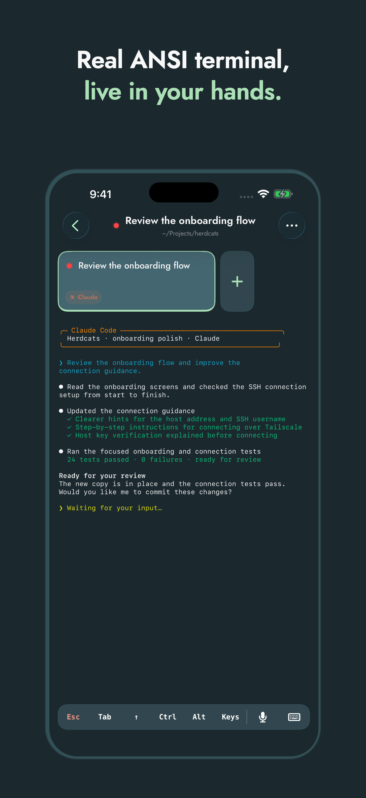</a>
  <a href="assets/screenshots/04-keys.png">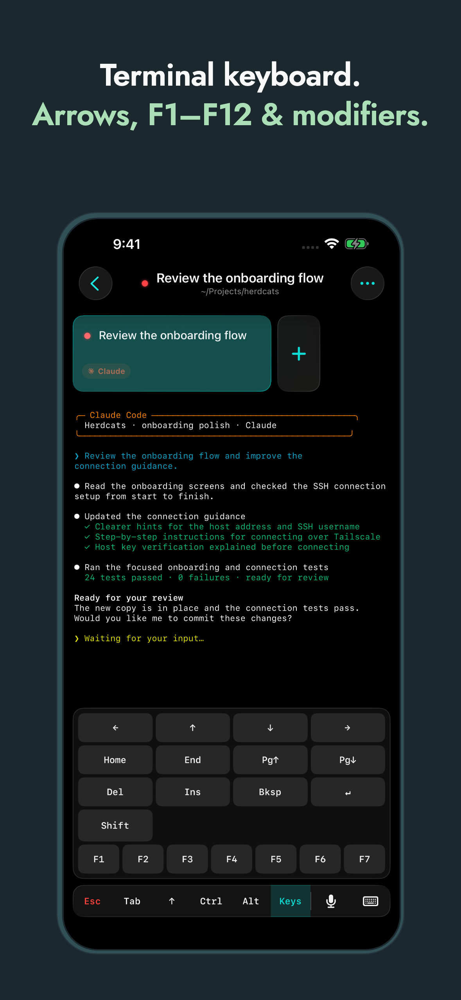</a>
  <a href="assets/screenshots/05-agent-pane.png">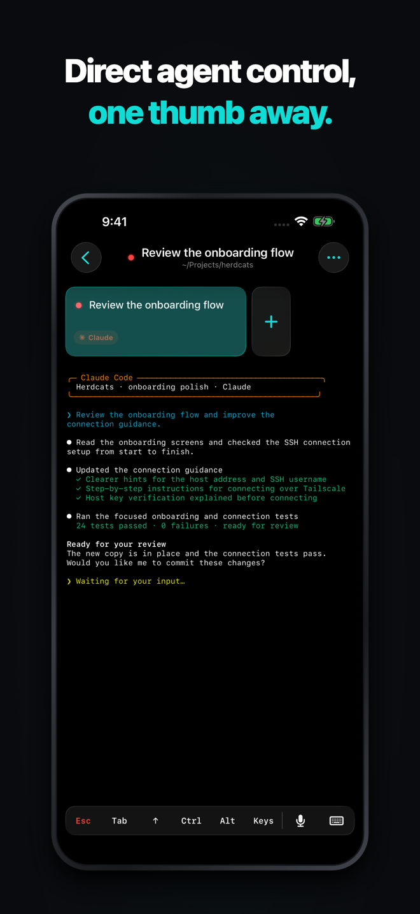</a>
</p>

<p align="center">
  <a href="assets/screenshots/06-quota.png">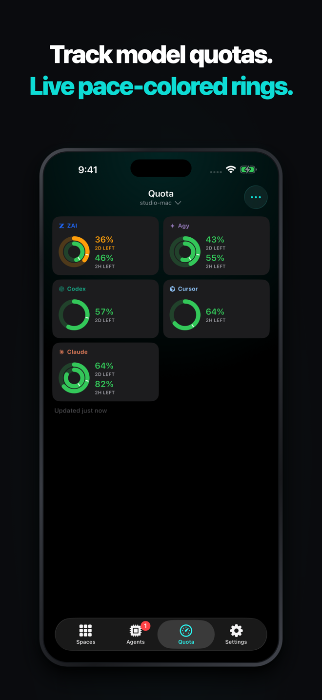</a>
  <a href="assets/screenshots/07-connect.png">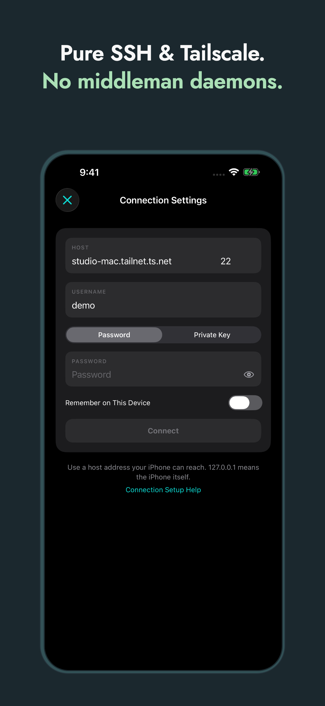</a>
  <a href="assets/screenshots/08-settings.png">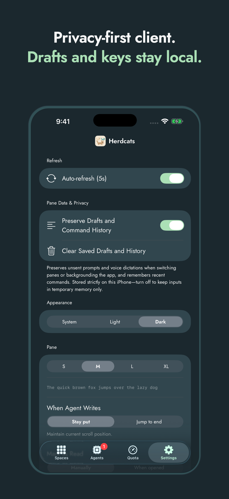</a>
  <a href="assets/screenshots/09-compose.png">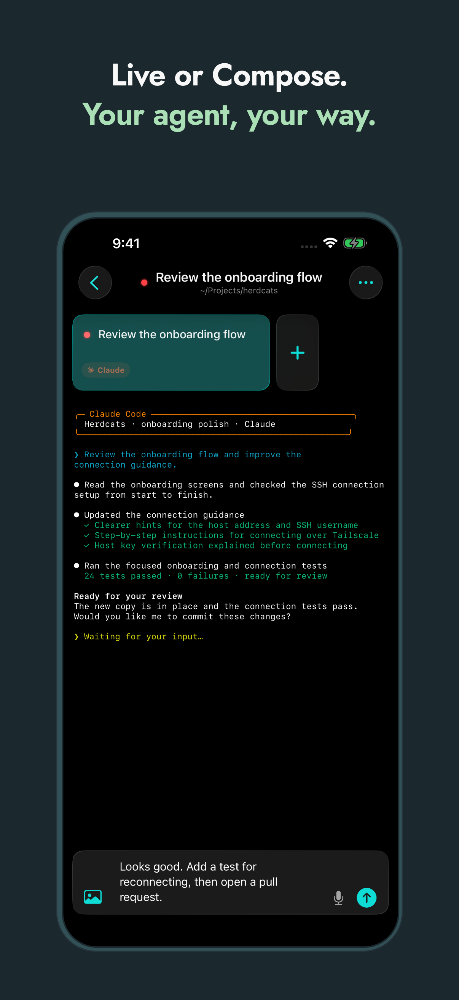</a>
  <a href="assets/screenshots/10-voice.png">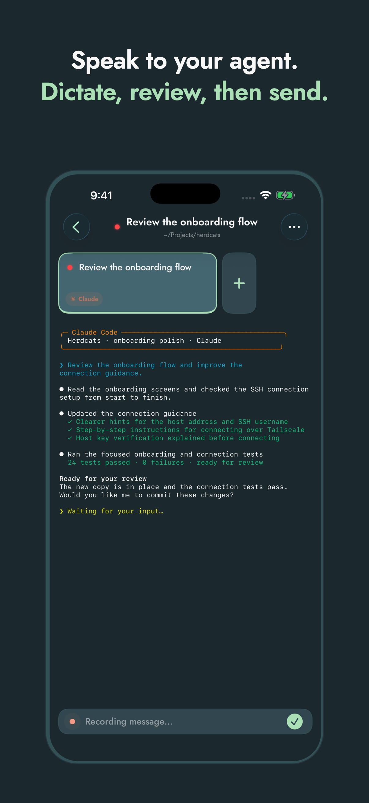</a>
</p>

## Build the iPhone app

You need a Mac with Xcode 26 or later and an installed iOS Simulator runtime.
Launch Xcode once to finish its setup. For a new contributor, fork this
repository and clone your fork in place of the URL below.

Run `ios/bin/setup` to check Xcode, install [XcodeGen](https://github.com/yonaskolb/XcodeGen)
with Homebrew if needed, generate the project, and resolve Swift packages.
If XcodeGen is missing, install [Homebrew](https://brew.sh) first. Citadel,
the SSH dependency, is pinned to 0.12.1. Simulator development requires no
Apple account or SSH server.

```sh
git clone https://github.com/zhiyao/herdcats.git
cd herdcats
ios/bin/setup
ios/bin/launch
```

`ios/bin/launch` builds the Debug app, boots an iPhone simulator if needed,
installs the app, and opens it in Simulator. It prefers an already-booted
iPhone; select a specific simulator with `ios/bin/launch --device="iPhone 17 Pro Max"`
or `--device=<UDID>`. Build output is saved to `ios/build/Launch/build.log`.

To work in Xcode, run `open ios/Herdcats.xcodeproj`, select the **Herdcats**
scheme and an iPhone simulator, then run. To build from the repository root:

```sh
xcodebuild -project ios/Herdcats.xcodeproj -scheme Herdcats \
  -destination 'generic/platform=iOS Simulator' build
```

For a physical iPhone, select your own development team in Xcode's Signing &
Capabilities after generation. `ios/project.yml` is the source of truth;
regeneration replaces manual project settings. For command-line device builds,
pass your own team using `DEVELOPMENT_TEAM=YOUR_TEAM_ID`.

The app and website share the three-cat pixel icon. Agent badges retain their
standard logos. Regenerate the launch-cat assets with
`python3 ios/scripts/generate_launch_cat.py`.

## Connect to Herdr

1. Install Herdr on your remote machine and start its default session.
2. Enable SSH access. On macOS, enable **System Settings → General → Sharing →
   Remote Login**. Confirm that SSH works with your account.
3. Connect the phone and machine to the same Tailscale network, or use another
   network where the phone can reach the SSH server.
4. Enter the host, port, username, and password or an **OpenSSH
   ed25519 private key** (enter its passphrase if encrypted) in Herdcats.
5. Compare the host-key fingerprint shown by the app with the server's
   fingerprint through a trusted channel, then approve it.

Remembered credentials and approved host keys stay in the iOS Keychain. A
changed host key blocks connection, including automatic reconnects.

Optional: install [quota-axi](https://www.npmjs.com/package/quota-axi) on the
connected machine to show provider quota. It is not required for pane access.

## Tests and GitHub Actions

[GitHub Actions](https://github.com/zhiyao/herdcats/actions) runs on pushes to
`main`, pull requests, and manual dispatch:

- **iOS:** generate the Xcode project, check attachment-storage behavior, build
  the app, and run Swift unit tests on an available iPhone simulator.
- **Web:** install locked dependencies, run server regression tests, and build
  the static website.

These checks require no SSH server, Apple account credentials, or deployment
secrets. Simulator tests use ad-hoc signing so Keychain tests receive their
entitlements.

Changes to `main` require a pull request and passing **iOS** and **Web** checks.
Dependabot checks dependencies weekly and opens update pull requests for review.
For Swift dependency updates, copy the proposed version changes into
`ios/project.yml`, regenerate with `(cd ios && xcodegen generate)`, and commit
the resulting project and lockfile before merging.

Run the same checks locally from the repository root:

```sh
python3 ios/HerdcatsTests/test_attachment_storage.py
xcodebuild -project ios/Herdcats.xcodeproj -scheme Herdcats -showdestinations

# Replace SIMULATOR_UDID with an available iPhone simulator ID.
xcodebuild -project ios/Herdcats.xcodeproj -scheme Herdcats \
  -destination 'platform=iOS Simulator,id=SIMULATOR_UDID' \
  test -only-testing:HerdcatsTests \
  CODE_SIGNING_ALLOWED=YES CODE_SIGN_IDENTITY=-
```

Live SSH UI tests are separate from CI. Some send input to panes: use a
**disposable SSH server and Herdr session**, with a locally generated key kept
outside Git. Configure `TEST_RUNNER_HC_USER`, `TEST_RUNNER_HC_PORT`, and
`TEST_RUNNER_HC_KEY_PATH`; live connection tests skip when the key path is absent.

## iPhone screenshots with mock data

Capture the real SwiftUI screens with read-only sample workspaces, agents,
terminal output, quotas, a Compose draft, and voice recording. The recording
fixture displays the native dictation UI without opening the microphone.
No SSH server or credentials are needed:

```sh
ios/bin/screenshots-mock
npm ci --prefix ios/app-store-images
ios/bin/screenshots-app-store --iphone-input=ios/maestro/screenshots-output/mock-iPhone
```

The capture command builds a Debug app and defaults to an available iPhone 17
Pro Max simulator. Use `--device=<name-or-UDID>` to select another iPhone, or
`--app=<path-to-Debug-simulator-app>` to reuse a build. Raw captures go to
`ios/maestro/screenshots-output/mock-iPhone`; artwork exports go to a fresh
folder under `ios/maestro/app-store-output`, with a preview and manifests.
The screenshot fixture mode is compiled only into Debug simulator builds.

## Website

The `web/` directory contains the Next.js landing page. Use Node.js 22 or later:

```sh
cd web
npm ci
node --test test/server.test.js
npm run build
npm run dev
```

The production build exports static files to `web/out/`. The website can be
hosted independently of the iPhone app.

## Current limitations

- SSH authentication supports passwords and OpenSSH ed25519 keys, including
  passphrase-protected keys using AES-128-CTR or AES-256-CTR and bcrypt with
  1–256 rounds. Other key formats and encryption settings are unsupported.
  Remembering the passphrase is optional; without it, unlock the key again
  after restarting the app.
- A readable Herdr default session is required; session selection is not wired up.
- Backgrounding pauses polling. This is not a general-purpose SSH shell.
- There is no in-app host-key rotation flow. A changed key fails closed.
- Uploaded photos remain under `~/.cache/herdrcat/attachments` on the connected
  machine until you remove them; the app does not automatically delete them.
- Saved-machine routing uses the gateway machine's SSH configuration. Quota and
  photos are available only on the directly connected host.

## Contributing

Bug reports, documentation improvements, and focused code changes are welcome.
Read [CONTRIBUTING.md](CONTRIBUTING.md) for setup, validation, and the PR process.
Community participation follows [CODE_OF_CONDUCT.md](CODE_OF_CONDUCT.md).
Maintainers can follow [RELEASING.md](RELEASING.md) to prepare a source release.

## Security

Report vulnerabilities through [GitHub's private reporting form](https://github.com/zhiyao/herdcats/security/advisories/new).
See [SECURITY.md](SECURITY.md) for supported versions and reporting guidance.

## License

[GPLv3 with an additional permission for Apple App Store and Google Play
 distribution](LICENSE). See [third-party notices](THIRD_PARTY_NOTICES.md) for
dependency licenses, artwork provenance, and screenshot-tooling terms.
Internal planning documents, local configuration,
credentials, and generated review artifacts are excluded from this repository.
